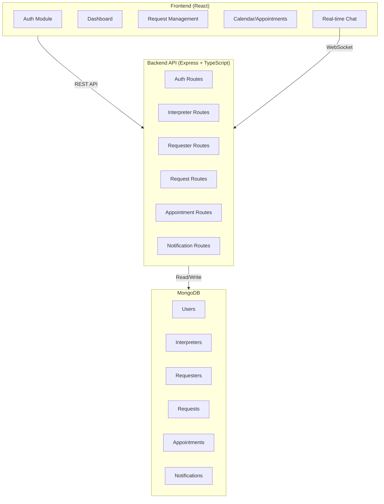

# Patient Language App

A full-stack platform connecting medical professionals with language interpreters. Requesters submit interpretation requests, interpreters accept matches, and both communicate via integrated chat with appointment scheduling.

---

## 🏗️ System Architecture



---

## 📦 Components

### Backend API (`/backend`)
- **Framework:** Express.js + TypeScript
- **Authentication:** JWT with bcrypt
- **Database:** MongoDB + Mongoose
- **Services:** Email (Nodemailer), Logging (Winston)

**Key Routes:**
| Endpoint | Purpose |
|----------|---------|
| `/api/auth` | Login, registration, password reset |
| `/api/interpreter` | Interpreter profiles & language skills |
| `/api/requester` | Requester profiles & facility info |
| `/api/request` | Create/manage interpretation requests |
| `/api/appointment` | Schedule and track appointments |
| `/api/notification` | Real-time notifications |

📖 [Full API docs →](backend/README.md)

### Frontend (`/frontend`)
- **Framework:** React + TypeScript
- **UI Library:** Material-UI
- **Chat:** CometChat integration
- **Forms:** Formik + Yup validation

**Key Modules:**
- Authentication (login, signup, verification)
- Request management (create, browse, accept)
- Appointment calendar & scheduling
- Real-time messaging
- Notifications & alerts

📖 [Full frontend docs →](frontend/README.md)

### Database Models
```
User (base)
├── Interpreter (extends User) → languages, qualifications
├── Requester (extends User) → facility info
Request → language, clinical details, status
Appointment → interpreter + requester + dates
Notification → events & updates
```

---

## 🚀 Quick Start

```bash
# Backend
cd backend && npm install && npm run start-dev  # http://localhost:8080

# Frontend (new terminal)
cd frontend && npm install && npm start  # http://localhost:3000
```

Requires: Node.js 14+, MongoDB

---

## 📄 License

ISC
